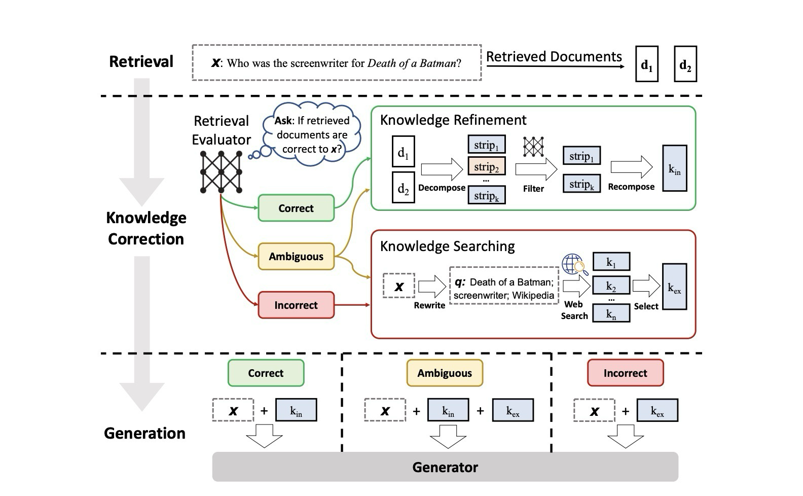

# Corrective Retrieval Augmented Generation (C-RAG)

> **Motivated by the research paper:**  
> [Corrective Retrieval-Augmented Generation (C-RAG): Correcting LLMs with Web Search](https://arxiv.org/pdf/2401.15884)

---

## Overview

C-RAG is an advanced Retrieval Augmented Generation workflow implemented in Python using the LangChain/Langgraoh frameworks. It enhances LLM responses by integrating a corrective feedback loop and web search as a fallback knowledge base, inspired by the C-RAG research paper.

---

## Project Image

*Image source: [https://arxiv.org/pdf/2401.15884]*

---

## Features

- Retrieval Augmented Generation system from scratch
- Web Search integration as a fallback knowledge base
- Retriever module for document retrieval and knowledge refinement
- Generator module for answer generation

---

## Workflow

The C-RAG workflow operates as follows (as described in the paper):

1. **Relevant Retrieval:**  
   If the retrieved documents are relevant to the query, the LLM generates an answer using these documents.

2. **Ambiguous Retrieval:**  
   If the retrieved documents are ambiguous or insufficient, the system triggers a web search to gather additional context, then refines the answer.

3. **Not Relevant:**  
   If no relevant documents are found, the system directly uses web search results to generate the answer.

This corrective loop ensures more accurate and reliable responses for knowledge-intensive tasks.

---

## Getting Started

1. Clone the repository.
2. Install dependencies.
3. Add your API keys and configuration.
4. Run the main script to start the C-RAG workflow.

---

## Reference

- [Corrective Retrieval-Augmented Generation (C-RAG): Correcting LLMs with Web Search](https://arxiv.org/pdf/2401.15884)

---